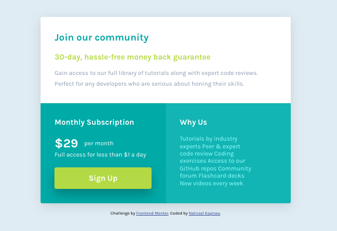

# Frontend Mentor - Single price grid component solution

This is a solution to the [Single price grid component challenge on Frontend Mentor](https://www.frontendmentor.io/challenges/single-price-grid-component-5ce41129d0ff452fec5abbbc).

## Table of contents

- [Overview](#overview)
  - [The challenge](#the-challenge)
  - [Screenshot](#screenshot)
  - [Links](#links)
- [My process](#my-process)
  - [Built with](#built-with)
  - [What I learned](#what-i-learned)
  - [Continued development](#continued-development)
  - [Useful resources](#useful-resources)
- [Author](#author)
- [Acknowledgments](#acknowledgments)

## Overview

### The challenge

Users should be able to:

- View the optimal layout for the component depending on their device's screen size
- See a hover state on desktop for the Sign Up call-to-action

### Screenshot

### Links

- Solution URL: [Github Link](https://github.com/NatnaelSisay/single-price-grid-component-master)
- Live Site URL: [Netlify Link](https://main--magenta-banoffee-fb5571.netlify.app/)

## My process

### Built with

- Semantic HTML5 markup
- CSS custom properties
- Flexbox
- CSS Grid
- Mobile-first workflow
- [SASS](https://sass-lang.com/) - CSS pre-processor
- [Parcel](https://parceljs.org/) - Build tool

### What I learned

How to effectively convert design into responsive website using technologies
such as SASS and Parcell for development.

### Continued development

I have created a base structure for the SASS files but i belive they can be more organized and optimized.

### Useful resources

- [CSS Scan](https://getcssscan.com/css-box-shadow-examples) - This helped me for setting up box shadow with just a click.
- [Josh Comeau](https://www.joshwcomeau.com/css/custom-css-reset/) - The perfect place for CSS Rest.
- [Sass @import, @use and @forward](https://www.youtube.com/watch?v=CR-a8upNjJ0) - clearly explain what they were and how i could use them on the project.
- [ColorSlurp](https://colorslurp.com/) - I used to detect the collor accurelty from my design document.

## Author

- LinkedIn - [Natnael Kagnaw](https://www.linkedin.com/in/natnael-kagnaw/)
- Frontend Mentor - [@NatnaelSisay](https://www.frontendmentor.io/profile/NatnaelSisay)

## Acknowledgments

I would like to thank Front-end mentor and the discord community and Also [Kevin Powell](https://www.youtube.com/@KevinPowell) from YouTube.
